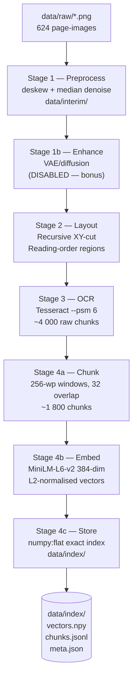

# A2 — Knowledge-Base Pipeline Diagram

## Overview

The pipeline turns 624 scanned page-images of *The Home-Keeping Book* (1918) into a
searchable vector index in four stages.  Every design choice below is measured on the
40-page human-verified held-out slice (`grading_kit/heldout_pages/` + `labels.jsonl`).

---

## End-to-End Flow

```
data/raw/*.png          (624 page-images, 300 DPI grayscale)
       │
       ▼  Stage 1 — PREPROCESS  (ingest/preprocess.py)
       │   deskew (profile-score sweep)
       │   median denoise (ksize 3)
       │   binarize OFF by default (Tesseract does it internally)
       │   despeckle OFF (only applies when binarizing)
       │   cache → data/interim/<page_id>.png
       │
       ▼  Stage 1b — ENHANCE  (ingest/enhance.py)   [DISABLED — bonus]
       │   VAE/diffusion generative repair — not trained; enhance.enabled = false
       │
       ▼  Stage 2 — LAYOUT  (vision/layout.py)
       │   recursive XY-cut on ink projection
       │   columns split first (full-height gutter gap ≥ 2.5% page width)
       │   rows split on gap factor × local leading
       │   leaf classification: text | heading | table | figure
       │   output: list[Region] in reading order
       │
       ▼  Stage 3 — OCR  (vision/ocr.py)
       │   backend: Tesseract 5, --psm 6 (uniform text block)
       │   one Chunk per Region (text + heading; figure skipped)
       │   output: list[Chunk]  (~4 000 raw region chunks)
       │
       ▼  Stage 4a — CHUNK  (index/chunk.py)
       │   regions concatenated per doc in Stage 2 reading order
       │   sliding window: 256 wordpieces, 32-piece overlap
       │   word boundaries preserved; tokeniser used only to count
       │   output: list[Chunk]  (~1 800 windows)
       │
       ▼  Stage 4b — EMBED  (index/embed.py)
       │   model: sentence-transformers/all-MiniLM-L6-v2 (384-dim)
       │   L2-normalised → cosine ≡ inner product
       │   output: np.ndarray  shape (1800, 384)
       │
       ▼  Stage 4c — STORE  (index/store.py)
       │   backend: numpy:flat (exact inner-product, 0.004 ms/query)
       │   writes: data/index/{vectors.npy, chunks.jsonl, meta.json}
       │
       ▼  data/index/   ← grader entry point: scripts/build_index.sh
```

---

## Mermaid Diagram


---

## Stage-by-Stage Justification

### Stage 1 — Preprocessing

| Step | Enabled | Rationale |
|---|---|---|
| Deskew | ✅ | Coarse-to-fine profile-score sweep; measured skew ≤ 0.55° |
| Median denoise | ✅ | ksize 3; worth 0.009 CER on held-out slice |
| Binarize | ❌ | Tesseract binarises internally; Sauvola/Otsu both raised CER |
| Despeckle | ❌ | Only applies when binarising; off by default |

**Measured improvement:** raw CER 0.0914 → preprocessed 0.0797 (Tesseract, held-out 40 pages).

### Stage 2 — Layout (speciality E2)

**Method:** Recursive XY-cut on horizontal/vertical ink projections.
**Why not a learned detector?** `layoutparser`/`detectron2` do not install on Apple Silicon.
XY-cut suits this material (clean book page, generous leading, no rules).

| Layout type | n pages | Whole-page CER | Segmented CER |
|---|---|---|---|
| single_column | 6 | 0.0274 | 0.0344 |
| two_column | 18 | 0.0234 | 0.0260 |
| mixed | 16 | 0.1628 | 0.0259 |
| **all** | **40** | **0.0797** | **0.0272** |

Column-structure accuracy vs human labels: **33/40** (XY-cut) vs 15/40 (centre-crossing heuristic).

### Stage 3 — OCR

**Chosen backend:** Tesseract 5, `--psm 6`.

| Backend | CER | s/page |
|---|---|---|
| Tesseract --psm 6 | **0.0272** | 2.8 |
| TrOCR-base-printed | 0.8104 | 124.7 |
| TrOCR-small-printed | 0.8545 | 19.6 |
| TrOCR-small fine-tuned | 0.6971 | 35.6 |

Tesseract wins on both quality and speed.  TrOCR was fine-tuned (distilled on IA ABBYY text layer)
but the gap is structural: on identical line crops, Tesseract scores 0.0068 vs TrOCR-small 0.62.

### Stage 4 — Chunk / Embed / Store

**Chunking:** 256 wordpieces, 32 overlap.  Rationale: this corpus tokenises at 1.32 pieces/word,
so a 256-word window would be ~338 pieces and exceed MiniLM's 256-token limit.  Budget is
measured in wordpieces to prevent silent truncation.

**Embedding:** `all-MiniLM-L6-v2` (384-dim, 64-batch, L2-normalised).
Cosine scores lie in [−1, 1]; `retrieve.weak_threshold = 0.35` sits between a clear hit (0.65)
and a near-miss (0.26) on this corpus.

**Index backend:** `numpy:flat` exact matmul.  FAISS (flat or HNSW) conflicts with torch's
`libomp` on macOS (OMP Error #15 → SIGSEGV) and buys nothing here: 0.004 ms/query (numpy) vs
0.009 (FAISS flat) at recall@10 = 1.000 for all three.

---

## Cross-Cutting Seams

```
build_knowledge_base()
    wiring.register_all(cfg)       ← PII, logging, grounding hooks
    ...after ingest...   hooks.run(AFTER_INGEST)
    ...after OCR...      hooks.run(AFTER_OCR)   ← PII redaction on extracted text
    ...before index...   hooks.run(BEFORE_INDEX)
```

PII redaction (`governance/pii.py`) runs at `AFTER_OCR` so raw extracted text is
never stored in the index.  Structured logging (`logging_conf.py`) runs at every seam.
